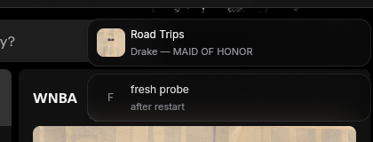
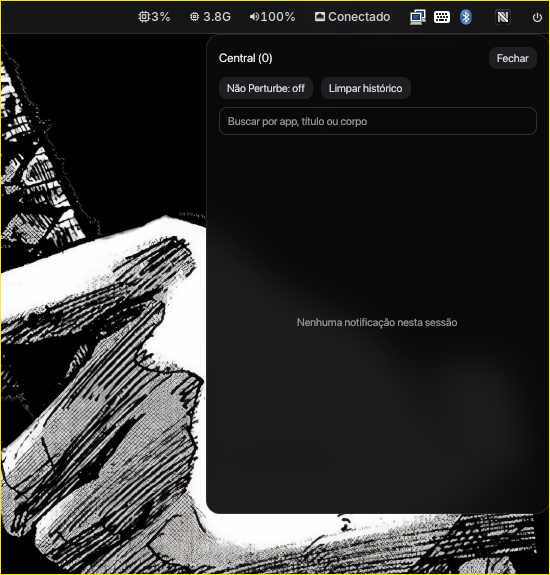

# Nobody

A Wayland notification daemon. It owns `org.freedesktop.Notifications` on the
session bus and renders notifications top-right in a layer-shell window.

Built with [GPUI](https://github.com/zed-industries/zed) and zbus. No GTK, no
`notify-osd` fork.

## Preview

Spotify notification with the current album cover:



Notification center with search, Do Not Disturb and Waybar integration:



## Install

```sh
curl -fsSL https://github.com/nuevosik/Nobody/releases/latest/download/install.sh | sh
```

That drops `nobody` in `~/.local/bin`. Override the destination with
`NOBODY_INSTALL_DIR`.

### Compositor

Stop any daemon already owning the name (e.g. mako), start nobody:

```conf
exec-once = pkill mako; nobody
```

Make sure `~/.local/bin` is on `PATH` for the compositor.

### From source

```sh
git clone https://github.com/nuevosik/Nobody
cd Nobody
cargo run --release
```

Needs a Wayland session with Layer Shell, a D-Bus session bus, Rust, and the
usual GPUI/Linux packages (`libwayland`, `libxkbcommon`, Vulkan).

## Use

- Click, Enter, Space or Escape dismisses a notification.
- Keeps 12 notifications, renders the 5 most recent.
- Timeout: `-1` means server default (5s), `0` never expires; critical
  notifications never auto-expire.
- Spotify notifications show the current album cover (via MPRIS + `curl`),
  cached under `~/.cache/nobody/covers/`.

### Central e Não Perturbe

```sh
nobody              # inicia o daemon, como sempre
nobody center toggle
nobody dismiss all
nobody dnd on | off | toggle
nobody dnd status   # mostra manual, tela cheia e efetivo
```

- A central lista as últimas 100 notificações da sessão (mais recentes
  primeiro), com busca por aplicativo, título ou corpo, botão de limpar e
  controle de Não Perturbe. Escape fecha; expirar ou dispensar um popup
  preserva o registro; limpar preserva a fila ativa.
- Silêncio efetivo = manual OU tela cheia. O detector de tela cheia nunca
  sobrescreve a preferência manual; ao sair do silêncio, só aparecem
  notificações ainda ativas (o histórico não é reproduzido).
- `nobody dismiss all` dispensa todas as notificações ativas de uma vez,
  preservando o histórico. Pode ser associado a um atalho do desktop.
- Limitação desta entrega: histórico apenas em memória — sem banco,
  persistência, exportação, ações de aplicativos ou novas bibliotecas.
  Reiniciar o daemon começa com histórico vazio.

### Waybar

With Nobody installed in `~/.local/bin`, run from this checkout:

```sh
install -Dm644 assets/nobody-badge.png "$HOME/.local/share/nobody/nobody-badge.png"
```

Add `"image#nobody"` to `modules-right` in your Waybar configuration, then
add this module at the top level:

```json
"image#nobody": {
    "exec": "printf '%s\\n' \"$HOME/.local/share/nobody/nobody-badge.png\" 'Central de notificações'",
    "size": 16,
    "interval": 3600,
    "on-click": "\"$HOME/.local/bin/nobody\" center toggle",
    "tooltip": true
}
```

Add to Waybar's `style.css`:

```css
#image.nobody { padding: 0 8px; }
#image.nobody:hover { background: rgba(255, 255, 255, 0.10); }
```

Restart Waybar to load the module. Clicking the icon toggles the central.
If Nobody was installed elsewhere, adjust `on-click` to that binary.
This setup is optional; the installer does not modify your Waybar configuration.

Debug:

| env | effect |
| --- | --- |
| `PREFERS_REDUCED_MOTION=1` | disables animations |

## Behavior

- `Notify`, `CloseNotification`, `GetCapabilities`, `GetServerInformation`;
  emits `NotificationClosed`.
- `replaces_id` replaces atomically.
- Icon path/name plus `desktop-entry` lookup scoped to known locations;
  markup is stripped. No actions, `image-data` or persistence.

## Architecture

Four layers, one rule: `presentation` and `infrastructure` never import each
other — they talk through the `domain` queue. Details in
`docs/architecture.md`.

```
domain <- application <- infrastructure / presentation
```

## Development

```bash
cargo fmt --check
cargo check --all-targets
cargo clippy --all-targets -- -D warnings
cargo test --all-targets
```

## Release

```sh
./scripts/release.sh 0.1.1
```

Bumps `Cargo.toml`, tags `v0.1.1`, pushes. GitHub Actions builds
`nobody-<triple>.tar.gz` and attaches it to the release, which is what
`install.sh` downloads.
